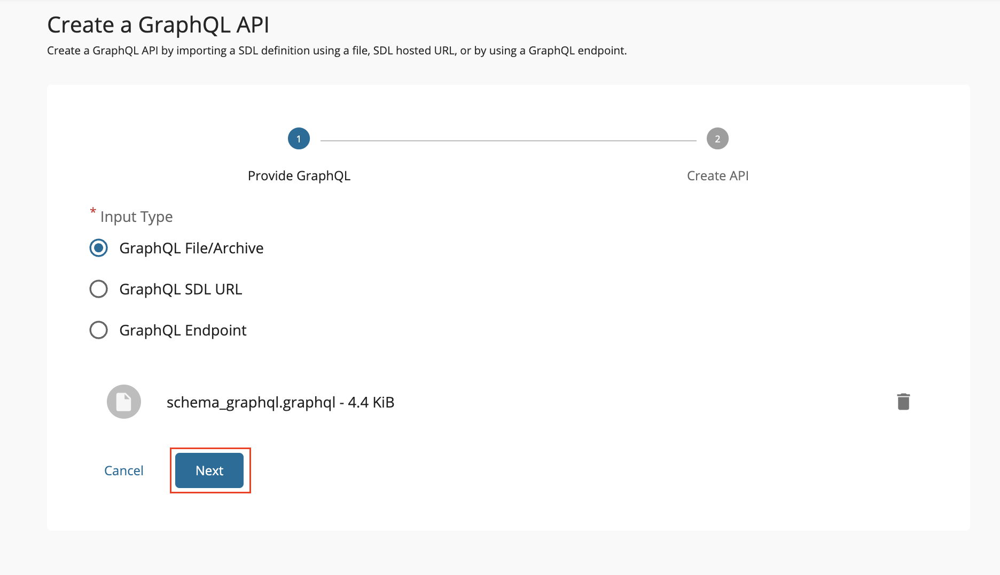
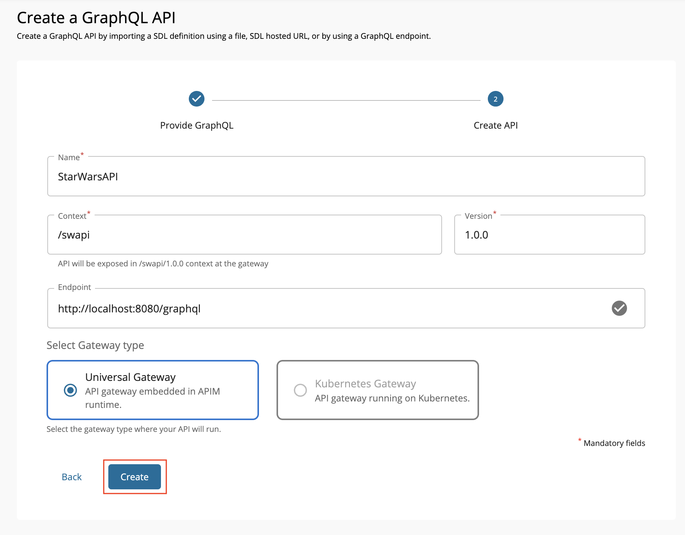

### Step 1 - Start the GraphQL backend server

Let's use the Star Wars sample backend server as the backend for the GraphQL API.

1. Clone the [WSO2 API Manager Samples](https://github.com/wso2/samples-apim) repository.

    ```
    git clone https://github.com/wso2/samples-apim

    ```

2. Navigate to `graphql-backend` directory.

    ```
    cd samples-apim/graphql-backend
    ```

3. Run `npm install` to install the necessary node modules.

4. Run `npm start` to start the server.

    Once the above steps are done, the Star Wars server will be running on `http://localhost:8080`.

    [{: style="width:45%"}](../../assets/img/learn/cli-output.png)

    You can use `http://localhost:8080/graphql` as the endpoint when creating the GraphQL API.

### Step 2 - Design a GraphQL API

1. Sign in to the API Publisher Portal.
   
    `https://<hostname>:9443/publisher` 
   
    Example: `https://localhost:9443/publisher`

    Let's use `admin` as the username and password to sign in.

2. Click **Create API** and then click **Import GraphQL SDL**.

     [](../../assets/img/learn/create-graphql-schema-option.png)

3. Import the schema by dragging and dropping the file or by uploading the file, and click **Next**.

       Let's use the [StarWarsAPI schema definition](../../assets/attachments/learn/schema_graphql.graphql) to create the schema file. 

       <div class="admonition note">
       <p class="admonition-title">Note</p>
       <ul><li>
       <p>You need to define the SDL Schema based on the [GraphQL schema design best practices](https://graphql.org/learn/best-practices/).</p></li>
       <li>The file extension can be either `.graphql`, `.txt`, or `.json`. </li><li> The file name can be any name, which is based on your preference.</li></ul>
       </div>

        [{: style="width:80%"}](../../assets/img/learn/import-graphql-schema-via-file.png)

4. Enter the GraphQL API related details and click **Create**.
    
    Let's create an API named "StarWarsAPI" using the following sample data.

      <table>
      <thead>
      <tr class="header">
      <th><div>
      <div>
      <b>Field</b>
      </div>
      </div></th>
      <th><div>
      <div>
      <b>Description</b>
      </div>
      </div></th>
      </tr>
      </thead>
      <td >
         <p>Name</p>
      </td>
      <td>
         <p>StarWarsAPI</p>
      </td>
      </tr>
      <tr>
      <td>
         <p>Context</p>
      </td>
      <td>
         <p><code>/swapi</code></p>
      </td>
      </tr>
      <tr>
      <td>
         <p>Version</p>
      </td>
      <td>
         <p>1.0.0</p>
      </td>
      </tr>
      <tr>
      <td>
         <p>Endpoint</p>
      </td>
      <td>
         <p>http://localhost:8080/graphql</p>
      <p>
      <ul>
      <li>
      When you provide the HTTP URL as the backend endpoint, WSO2 API-M will internally derive the corresponding WebSocket URL <code>ws://localhost:8080/graphql</code>.</li><li>
      Thereafter, the API Gateway will use this WebSocket URL as the backend subscription endpoint of the GraphQL API.</li> 
      </ul></p>
      </div>
      </td>
      </tr>
      </table>

       [{: style="width:75%"}](../../assets/img/learn/create-graphql-api-details.png)

5. Optionally, modify the existing GraphQL schema definition.

    1. Navigate to **Develop**, **API Configurations**, and click **Schema Definition**.

    2. Click **Download Definition**.

         The existing GraphQL API schema gets downloaded.

         [{: style="width:80%"}](../../assets/img/learn/download-schema-definition.png)

    3. Update the schema definition as required.

    4. Click **Import Definition** to import the updated schema definition.

6. Update the GraphQL API operations as required.

    Instead of resources, which get populated for REST APIs, operations get populated for GraphQL APIs.

    1. Click **Show More** under the **Operations** section in the **Overview** page to navigate to the operations page.

         [](../../assets/img/learn/operations.png)  
     
    2. Update the operations as required.
         
        The Publisher can add Rate Limiting policies, scopes and enable/disable security for each of the GraphQL API operations.

        1. **Create scopes**.

            Repeat the following sub-steps to create two scopes named `adminScope` and `FilmSubscriberScope`.

            1. Click **Local Scopes**, and then click **Create Scopes**.

                [](../../assets/img/learn/add-scope.png)

            2. Enter the required details.

                   <div class="admonition note">
                   <p class="admonition-title">Note</p>
                   <p> 
                   <ul><li>The role that you enter <b>should be a valid role that already exists in WSO2 API Manager</b>. Make sure to assign the role to the user. </li><li>For more information, see <a href="https://apim.docs.wso2.com/en/latest/administer/managing-users-and-roles/managing-users">Adding Users</a> and <a href="https://apim.docs.wso2.com/en/latest/administer/managing-users-and-roles/managing-user-roles">Adding User Roles</a>.</li></ul>
                   </p>
                   </div>
                  
                   Enter the following details for this example scenario.

                   | **Name** | **Role** |
                   |----------|----------|
                   | `FilmSubscriber` | `FilmSubscriber` |
                   | `adminScope` | `admin` |

                   [](../../assets/img/learn/create-scope.png)

            3. Press `Enter` to add each role. 

            4. Click **Save**.

                 [](../../assets/img/learn/starwars-scope-list.png)

         2. **Define the operation level configurations**.

            1. Click **Operations**.
            
            2. Click **Operation Level** to apply Rate Limiting for operations.

                [](../../assets/img/learn/update-operations.png) 

            3. Select a Rate Limiting Policy, scope, and enable or disable security for each of the operations. 

                   Apply the following scopes to the respective operations.

                   | **Operation** | **Scope** |
                   |----------|----------|
                   | `allDroids` |`FilmSubscriber` |
                   | `allCharacters` |`adminScope` |
            
            4. Click **Save**.

                 If you check the list of scopes, it should appear as follows:

                 [](../../assets/img/learn/scope-list.png)
