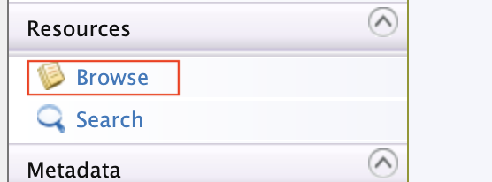
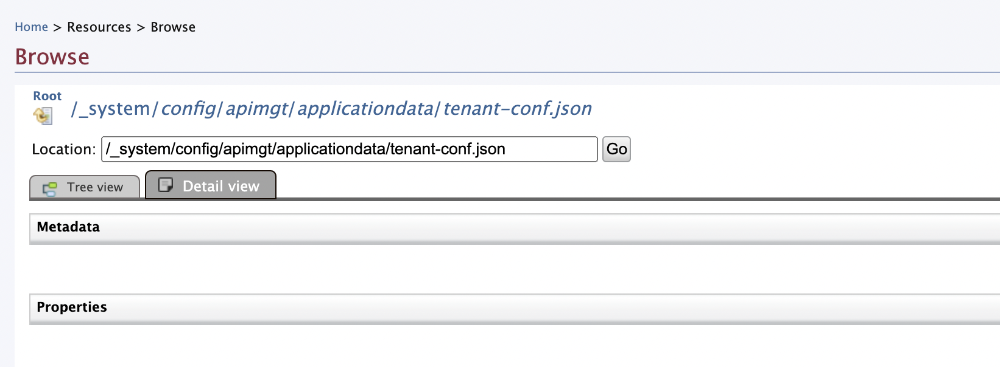
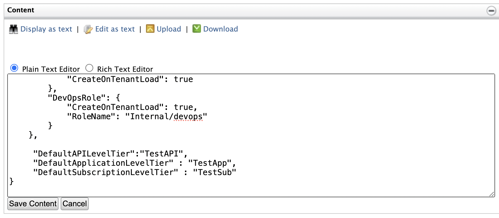

# Setting Throttling Limits

Throttling allows you to limit the number of successful hits to an API during a given period, typically in cases such as the following:

-   To protect your APIs from common types of security attacks such as certain types of denial of service (DOS) attacks
-   To regulate traffic according to infrastructure availability
-   To make an API, application, or a resource available to a consumer at different levels of service, usually for monetization purpose

You can define throttling at the API, application, resource and subscription levels. The final throttle limit granted to a given user on a given API is ultimately defined by the consolidated output of all throttling tiers together.

**Example** : Lets say two users are subscribed to an API using the Gold subscription, which allows 20 requests per minute. They both use the application App1 for this subscription, which again has a throttling tier set to 20 requests per minute. All resource level throttling tiers are unlimited. In this scenario, although both users are eligible for 20 requests per minute access to the API, each ideally has a limit of only 10 requests per minute. This is due to the application-level limitation of 20 requests per minute.

## Different levels of throttling

It is possible to throttle requests for each tier based on the request count per unit time or the amount of data (bandwidth) transferred through the Gateway per unit time. You can configure this via the Admin Portal as explained under [Adding New Throttling Policies]({{base_path}}/learn/rate-limiting/adding-new-throttling-policies/).


Let's take a look at the different levels of throttling:

-   [Subscription-level throttling (API publisher)](#subscription-level-throttling-api-publisher))
    -   [Burst Control](#burst-control)
-   [Subscription-level throttling (API subscriber)](#subscription-level-throttling-api-subscriber)
-   [Advanced throttling (API publisher)](#advanced-throttling-api-publisher)
    -   [API level throttling](#api-level-throttling)
    -   [Resource-level (Operation-level) Throttling](#resource-leveloperation-level-throttling)
    -   [Advanced Throttling tiers](#advanced-throttling-tiers)
-   [Application-level throttling (application developer)](#application-level-throttling-application-developer)
    -   [Application-level Throttling tiers](#SettingThrottlingLimits-Application-levelThrottlingtiers)

### Subscription-level throttling (API publisher)

Subscription-level throttling tiers can be applied for an API when creating APIs using the API Publisher portal.


##### Subscription-level Throttling tiers

The default throttling tiers are as follows:

-   **Bronze** : 1000 requests per minute
-   **Silver** : 2000 requests per minute
-   **Gold** : 5000 requests per minute
-   **Unlimited:** Allows unlimited access (you can disable the Unlimited tier by editing the `enable_unlimited_tier element` under `[apim.throttling]` in the `<API-M_HOME>/repository/conf/deployment.toml` file.)


It is also possible to specify a bandwidth per unit time instead of a number of requests. This can be done by an API Manager administrator. For information on editing the values of the existing tiers, defining new tiers, and specifying a bandwidth per unit time, see [Adding a new subscription-level throttling tier]({{base_path}}/learn/rate-limiting/adding-new-throttling-policies/#adding-a-new-subscription-level-throttling-tier).

  <div class="admonition info">
   <p class="admonition-title">Note</p>
<p> Note that when you edit an API with active subscribers, certain things like tier changes do not get automatically reflected to the subscribers. For such changes to take effect, the subscribers should resubscribe to the API and regenerate the access token. </p>
</div>


#### **Burst control**

With burst control, you can define tiers with a combination of, for example, a 1000 requests per day and 10 requests per second. Users are then throttled at two layers. Enforcing a rate limit protects the backend from sudden request bursts and controls the usage at a subscription and API level.

For instance, if there's a subscription level policy enforced over a long period, you may not want users to consume the entire quota within a short time span. Sudden spikes in usage or attacks from users can also be handled via rate limiting. You can define a spike arrest policy when the subscription level tier is created. For more information on using rate limiting in subscription tiers, refer [Adding a new subscription-level throttling tier]({{base_path}}/learn/rate-limiting/adding-new-throttling-policies/#adding-a-new-subscription-level-throttling-tier).

<div class="admonition info">
<p class="admonition-title">Note</p>
<p> <b>Spike Arrest Policy(burst control)</b> is used to protect the API backend against large number of traffic spikes and DoS attacks. Unlike setting one definite throttling tier (Quota), it helps to limit the sudden increase of number of requests at any point in time.</p>
</div>

As an example, if we specify a quota policy as 20 requests per minute, it is possible to send all 20 requests in first few seconds in one minute so that we cannot limit it. By defining a spike arrest policy as 10 requests per second, it equally scatters the number of requests over the given one minute. Therefore, by doing rate limiting we can protect the backend from sudden spikes and DoS attacks through spike arrest policy.


For each subscription level throttle key, a WS policy is created on demand. The request count is calculated and throttling occurs at the node level. If you are using a clustered deployment, the counters are replicated across the cluster.

### Subscription-level throttling (API subscriber)

After subscription-level throttling tiers are set and the API is published, at subscription time, the consumers of the API can sign in to the **Developer Portal** and select which tier (out of those enabled for subscribers) they are interested in, as shown below:


According to the selected tiers, the subscribers are granted a maximum number of requests to the API.

### Advanced throttling (API publisher)

Advanced throttling policies are applied when you are Publishing an API. It can be further divided into the following two levels base on the applicability.

-   API level throttling
-   Resource level (operational level) throttling

#### API level throttling

API level policies can be engaged via the resources section of an API in the Publisher portal by selecting **API Level** under **Rate limitting level** as shown below.


#### **Resource level(Operation level) Throttling**

An API is made up of one or more resources. Each resource handles a particular type of request and is similar to a method (function) in a larger API. You can use this method when handling a large number of request at resource level such as Financial transactions. For example, Imagine API have two resources and one resource take more request than other you do not need to throttle it in API level in that case you can use this.  Resource-level throttling tiers are set to HTTP verbs of an API's  resources.  You can apply resource-level throttling through the **Resources** section of an API as shown below.


#### Advanced Throttling tiers

The default throttling tiers are as follows:

-   **10KPerMin** : 10,000 requests per minute
-   **20KPerMin** : 20,000 requests per minute
-   **50KPerMin** : 50,000 requests per minute
-   **Unlimited:** Allows unlimited access (you can disable the Unlimited tier by editing the `enable_unlimited_tier element` under `[apim.throttling]` in the `<API-M_HOME>/repository/conf/deployment.toml` file.)

It is also possible to specify a bandwidth per unit time instead of a number of requests. This can be defined via the API Manager Admin Portal. For information on editing the values of the existing tiers, defining new tiers, and specifying a bandwidth per unit time, see [Adding a new advanced throttling policy]({{base_path}}/learn/rate-limiting/adding-new-throttling-policies/#adding-a-new-advanced-throttling-policy).

### Application-level throttling (application developer)

Application-level throttling tiers are defined at the time an application is created in the Developer Portal as shown below. The limits are restricted per token for a specific application.


An application is a logical collection of one or more APIs and is required to subscribe to an API. Applications allow you to use a single access token to invoke a collection of APIs and to subscribe to one API multiple times with different SLA levels.

An application is available to a consumer at different levels of service. For example, if you have infrastructure limitations in facilitating more than a certain number of requests to an application at a time, the throttling tiers can be set accordingly so that the application can have a maximum number of requests within a defined time.

#### Application-level Throttling tiers

The default throttling levels are as follows:

-   **10PerMin** : 10 requests per minute
-   **20PerMin** : 20 requests per minute
-   **50PerMin** : 50 requests per minute
-   **Unlimited:** Unlimited access. The **Default Application**, which is provided out of the box has the tier set to Unlimited.

It is also possible to specify a bandwidth per unit time instead of a number of requests. This can be done through the Admin Portal of API Manager. For information on editing the values of the existing tiers, defining new tiers and specifying a bandwidth per unit time, see [Adding a new application-level throttling tier]({{base_path}}/learn/rate-limiting/adding-new-throttling-policies/#adding-a-new-application-level-throttling-tier).

<div class="admonition info">
<p class="admonition-title">Note</p>
<p> When creating an API by importing a Swagger or Open API definition, the user can define the throttle policies for both API level and resource level using the <b>“x-wso2-throttling-tier"</b> extension.</p>
    ```yaml
    x-wso2-basePath: /petstore/v1
    x-wso2-throttling-tier: 10kPerMin
    x-wso2-production-endpoints:
    urls:
    - https://petstore.swagger.io/v2

    ```
<p>Resource level throttle policies also can be defined as well.</p>
    ```yaml
    paths:
        "/pet/findByStatus":
            get:
            tags:
            - pet
            summary: Finds Pets by status
            description: Multiple status values can be provided with comma separated strings
            operationId: findPetsByStatus
            x-wso2-throttling-tier: 20kPerMin
    ```
</div>

#### Changing the Default Tiers

Users can change the default tiers by appending the following config to the `tenant-conf.json` file in Management Console.

1.  Log in to the API Manager's management console ( `https://localhost:9443/carbon` ) and go to the **Resource &gt; Browse** menu.

     

2.  Browse for the `/_system/config/apimgt/applicationdata/tenant-conf.json` path.

     

3.  Add the following configurations to the ``tenant-conf.json` file.

    ```
         "DefaultAPILevelTier":"<Tier Name>",
         "DefaultApplicationLevelTier" : "<Tier Name>",
         "DefaultSubscriptionLevelTier" : "<Tier Name> "
    ```

     

